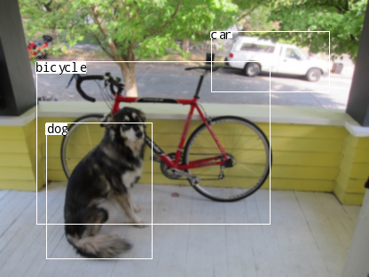

# YoloV2
Tiny-YoloV2 implementation on Julia by Knet framework.

The program uses pre-trained weigths and currently does not train the model.

first download pre-trained weights by:
```
$ wget https://pjreddie.com/media/files/yolov2-tiny-voc.weights
```
If you want to see accuracy on Voc Dataset, download the dataset by:
```
$ wget https://pjreddie.com/media/files/VOCtrainval_11-May-2012.tar
  tar xf VOCtrainval_11-May-2012.tar
```
If you don't want to see, you can just comment out following lines in the code:
```
images,labels = inputandlabelsdir(ACC_OUT,ACC_INPUT)
in,out,imgs = prepareinputlabels(images,labels)

accdata = minibatch(in,out,MINIBATCH_SIZE;xtype = xtype)
drawdata = minibatch(in,imgs,MINIBATCH_SIZE; xtype = xtype)

@time AP = accuracy(model,accdata,0.0,0.3,0.5)
@time result = saveoutput(model,drawdata,0.3,0.3; record = true, location = "VocResult")
display(AP)
```
Fill the Input folder with jpg images. The program prepares output and put them into output folder. If you want you can save output into another folder.

The code can:

1-Calculate accuracy on Voc Dataset

2-Tak the images and saves the output into the folder

3-Take an example image and diplay the output on the IDE.

Here is an example of input and output:

INPUT:
<p align="center">
  
</p> 

OUTPUT:
<p align="center">
  
</p> 

